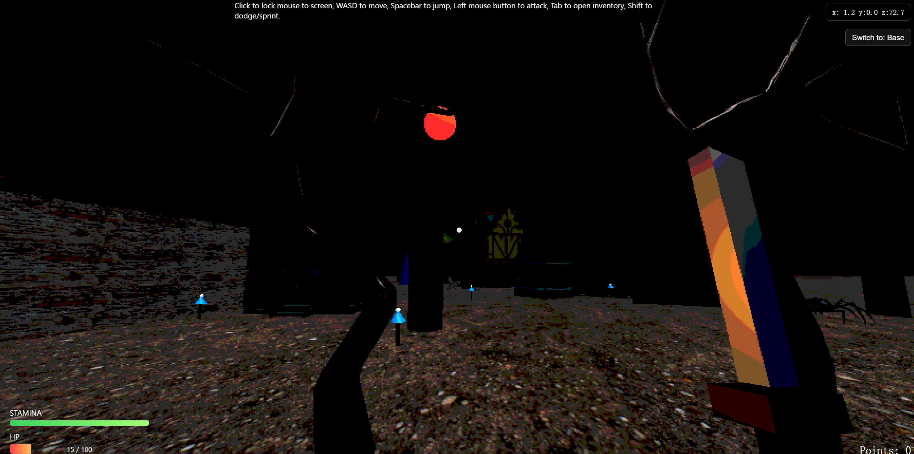
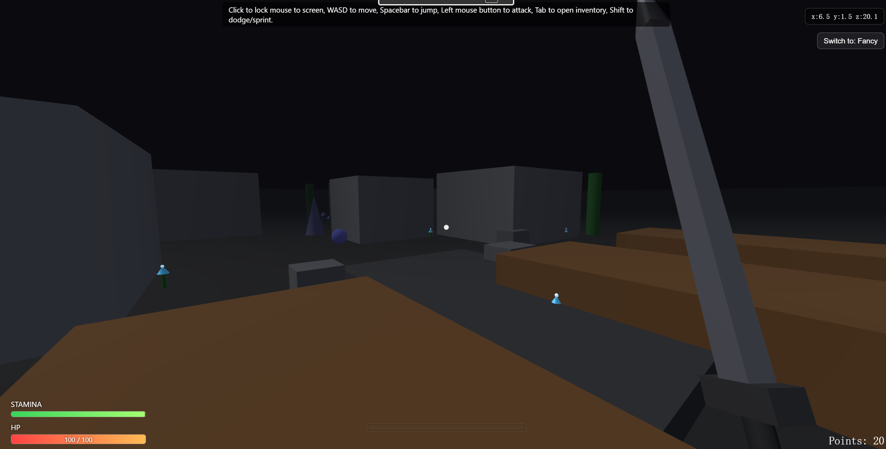
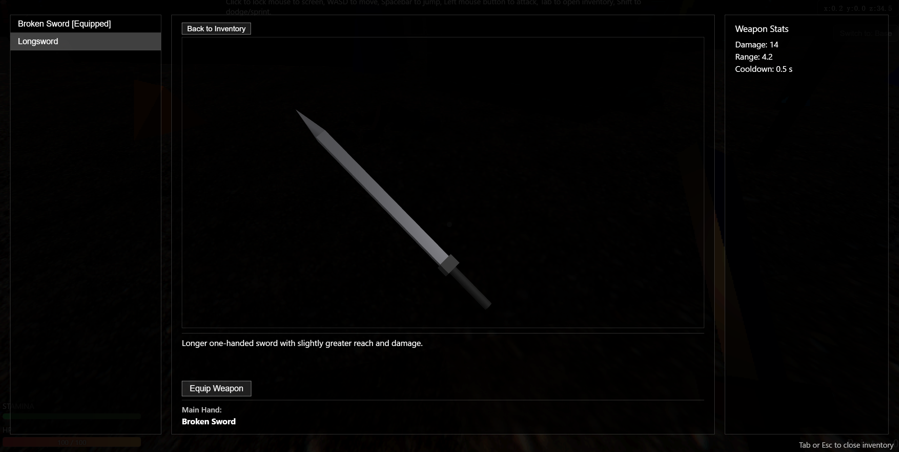

# King’s Field–like First-Person Action RPG (Web)

> A first-person action RPG inspired by early *King’s Field* and classic Souls-like design.  
> Built from scratch in JavaScript using Three.js, focusing on systemic combat, stamina-based decision making, and spatial tension.

Live Demo: https://aealoysius.github.io/KS_Demo/
---

## Gameplay Preview

---

## Project Overview

This project is a browser-based first-person action RPG inspired by early dungeon-style RPGs.  
Rather than pursuing visual fidelity, the design prioritizes:

- Deliberate combat pacing  
- Resource-driven decision making  
- Risk–reward loops inspired by Souls-like mechanics  
- Spatial tension created through level layout  

The entire game runs in the browser with no external engine dependency beyond Three.js.

---

## Core Combat & Player Systems

### First-Person Movement
- WASD movement with free-look mouse camera
- Manual jumping with gravity and platform landing checks

### Stamina-Driven Action Economy
- Attacking, jumping, sprinting, and dodging all consume stamina
- Delayed stamina regeneration encourages intentional pauses
- Continuous actions suppress regeneration, punishing button mashing

### Dash & Sprint Design
- **Short Shift press** → Directional dash (burst movement)
- **Long Shift press** → Sustained sprint with continuous stamina drain

### Charged Attack System
- Mouse button hold builds charge
- Higher charge increases both damage and stamina cost
- Full charge state provides visual feedback for timing decisions

---

## Risk–Reward & Death Loop

Inspired by Souls-like design philosophy, death is not a hard reset:

- All collected points are dropped at the death location
- Points can be recovered by returning to the drop
- Only one active drop exists — dying again overwrites the previous one

This design encourages cautious exploration and meaningful risk evaluation.

---

## Enemy & Encounter Design

- Hand-authored enemy spawn points tied to level progression
- Multiple enemy archetypes: basic, advanced, and boss
- Lightweight enemy–enemy collision resolution prevents unfair crowding
- Enemy density is intentionally low to preserve readability in tight spaces

---

## Level & World Design

- Open village-style hub connected to:
  - Narrow paths
  - Maze-like sections
  - A dedicated boss arena
- All level geometry is built from primitive shapes
- Chokepoints, sightlines, and room scale are designed to influence combat behavior

---

## Checkpoint System

- Manually activated checkpoints placed at key progression milestones
- Only one checkpoint can be active at a time
- Reduces frustration while preserving tension and commitment

---

## Inventory & Progression

- Tab-based inventory system
- Weapons must be discovered before they can be equipped
- Rings provide passive effects (e.g. life-steal)
- Equipment effects are directly integrated into combat logic

A separate Three.js scene is used to render real-time 3D previews of equipment.

---

## Technical Highlights

- Modular architecture separating:
  - Player control
  - Enemy logic
  - Level construction
  - Inventory UI
  - Checkpoint management
- Custom collision handling for:
  - Player vs environment
  - Enemy vs enemy interactions
- Fully browser-based implementation using JavaScript + Three.js

---

## Controls

| Input | Action |
|------|------|
| WASD | Move |
| Mouse | Look |
| Left Mouse | Charge / Attack |
| Space | Jump |
| Shift (Tap) | Dash |
| Shift (Hold) | Sprint |
| Tab | Open Inventory |

---

## Design Focus & Reflection

This project was created as an exploration of how classic action RPG principles can be translated into a modern, engine-free web environment.

Key takeaways include:
- The importance of stamina as a unifying decision-making resource
- How level geometry alone can shape combat behavior
- How minimal visuals can still support deep mechanical gameplay
